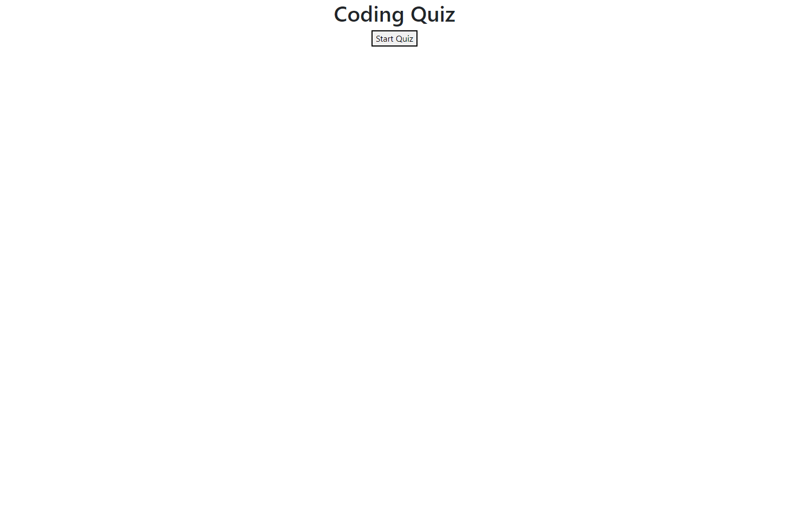

# Code Quiz
## Description
This application is a code quiz that a user can take. The user will click the start button, then a sixty-second timer will begin counting down and the user will be presented with a question. After the user answers a question, they will be presented with another question. If a question is answered incorrectly, ten seconds will be deducted from the timer. The quiz is over when all questions are answered or the timer reaches 0. Once the quiz is over, the user can save their initials and score.

## Installation
N/A

## Usage
Use this application to take a timed code quiz.

## Deployed Site

https://mtstall.github.io/coding-assessment/

## Credits
N/A